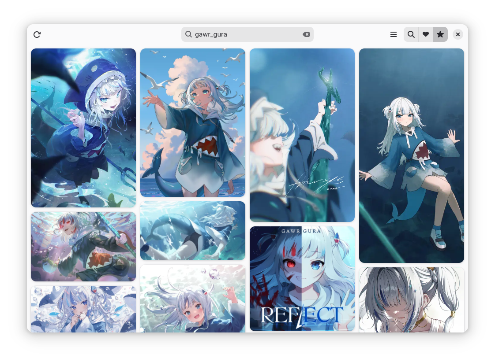

# Cardboard 

Browse Danbooru and save favorites

## Description
Cardboard (name subject to change) is browser for Danbooru that uses Adwaita and a masonry layout for the catalog.
It can save your favorite posts locally without an account and save up to 10 tags for the most recent posts (limited to 200) of those tags be displayed in a single catalog.

**CARDBOARD IS IN ALPHA**

**CARDBOARD NEEDS AN APP ICON**
## Features
  - Download posts
  - Save posts to favorites, optionally downloading the post's assets
  - Open posts and searches in multiple tabs
  - Reopen tabs previously open tabs on startup
  - Custom query for new tab
  - Save tags in *Saved Searches* for the most recent posts of those tags to be loaded in a single catalog
  - Infinite scroll
  - Fullscreen
  - Blacklist tags
  - *Safe Mode* (hides "Questionable" and "Explicit" posts)
  - Change number of posts per page and thumbnail size

## Install
### Flatpak
*TBA*

## Build
Install [GNOME Builder](https://flathub.org/apps/org.gnome.Builder)

1. Open GNOME Builder
2. Clone Repository
3. `https://github.com/blitz2015/Cardboard.git`
4. Run
5. Export if you want
